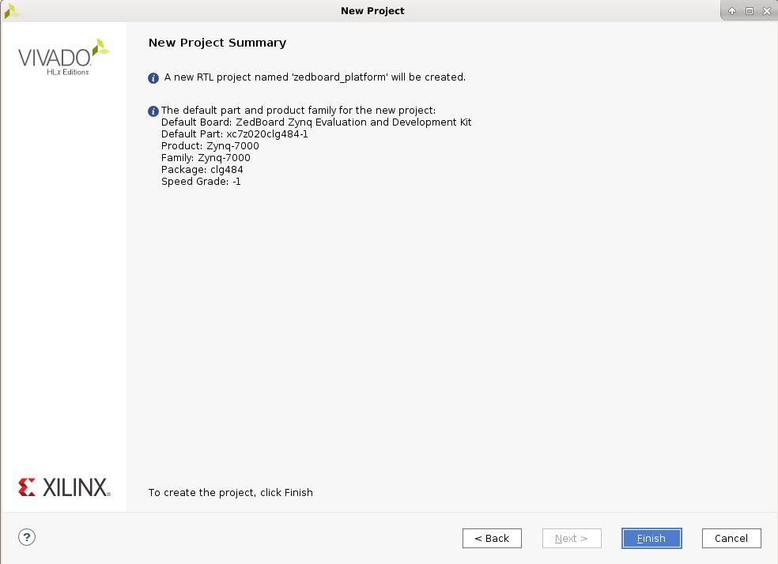
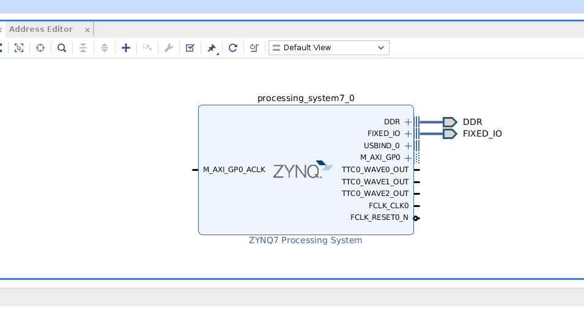
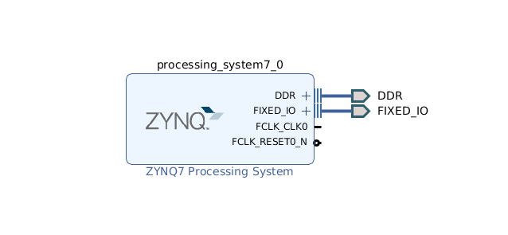
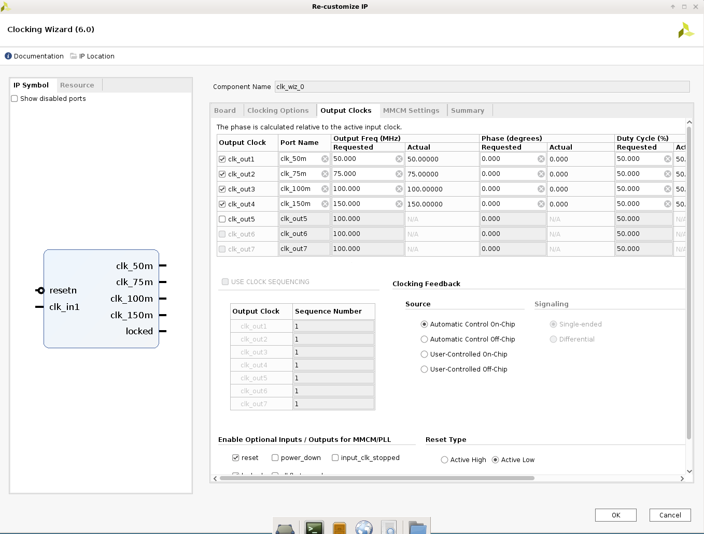
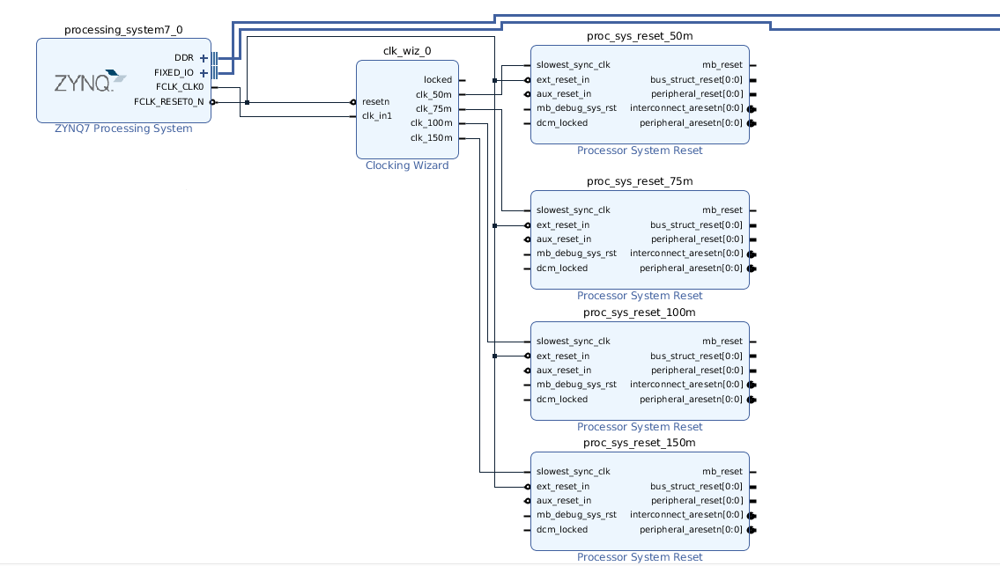
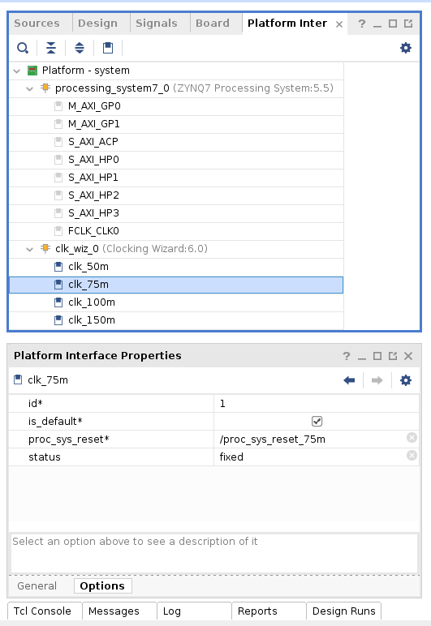
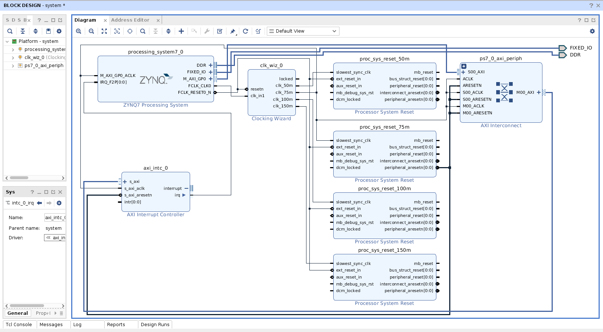
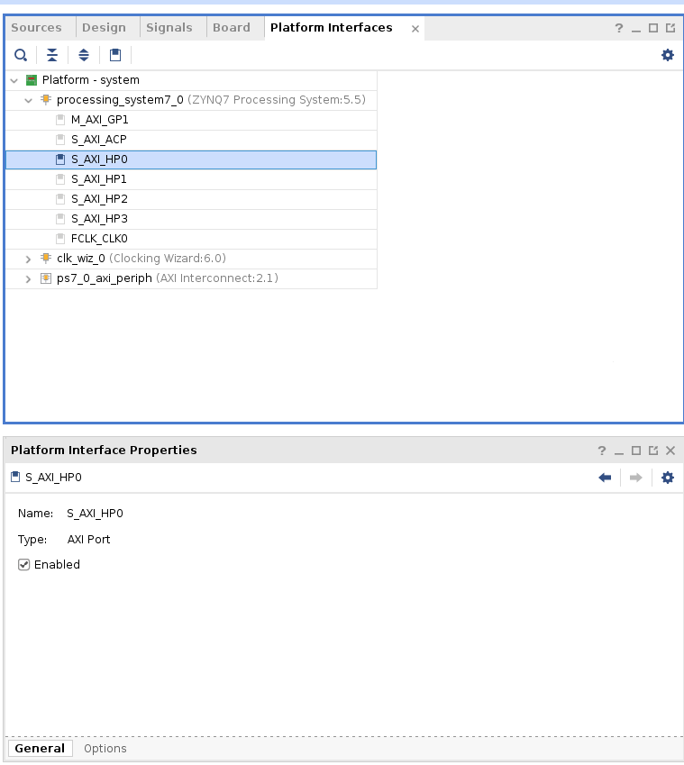
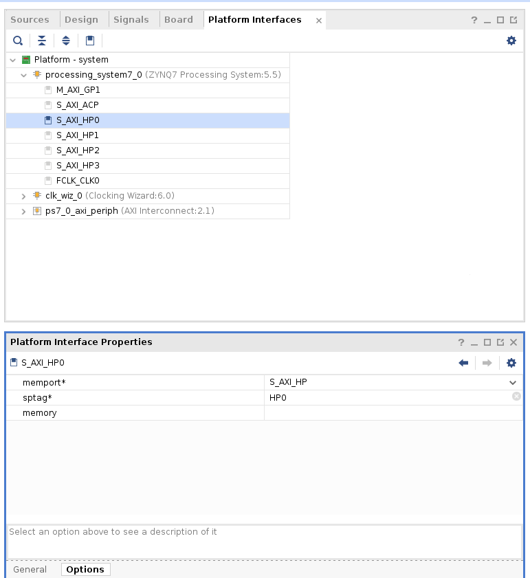

## Step 1: Create the Vivado Hardware Design and Generate XSA

### Create Base Vivado Project from Preset

1. Source <Vitis_Install_Directory>/settings64.sh, and call Vivado out by typing "vivado" in the console.<br />

2. Create a Vivado project named zcu104_custom_platform.

   a) Select ***File->Project->New***.<br />
   b) Click ***Next***.<br />
   c) In Project Name dialog set Project name to ```zedboard_platform```.<br />
   d) Click ***Next***.<br />
   e) Select ***RTL Project*** and check ***Do not specify sources at this time***, click next.<br />
   f) Select ***Boards*** tab and then select ***Zedboard Zynq Evaluation and Development Kit***<br />
   g) Click ***Next***, and your project summary should like below:<br />
   <br />
   h) Then click ***Finish***<br />

3. Create a block design named system.

   a) In ***Project Manager***, under ***IP INTEGRATOR***, select ***Create Block Design***.<br />
   b) Change the design name to ```system```.<br />
   c) Click ***OK***.<br />

4. Add Processing System IP and run block automation to configure it.

   a) Right click Diagram view and select ***Add IP***.<br />
   b) Search for ```zynq``` and then double-click the ***ZYNQ7 Processing System*** from the IP search results.<br />
   c) Click the ***Run Block Automation*** link to apply the board presets.<br />
      In the Run Block Automation dialog, ensure the following is check marked:<br />

      - All Automation
      - processing_system7_0
      - Apply Board Presets
      - Cross Trigger In -> Disable
      - Cross Trigger Out -> Disable

   d) Click ***OK***. You should get ZYNQ7 block configured like below:<br />
   <br />

***Note: At this stage, the Vivado block automation has added a Zynq UltraScale+ MPSoC block and applied all board presets for the ZCU104. For a custom board, please double click MPSoC block and setup parameters according to the board hardware. Next we'll add the IP blocks and metadata to create a base hardware design that supports acceleration kernels.***

### Customize System Design for Clock and Reset

1. Re-Customizing the Processor IP Block

   a) Double-click the ZYNQ7 block in the IP integrator diagram.<br />
   b) Select ***Page Navigator > MIO Configuration***.<br />
   c) Expand ***I/O Peripherals*** by clicking the ***>*** symbol.<br />
   d) Uncheck ***USB 0***
   e) Expand ***Application Processor Unit*** by clicking the ***>*** symbol.<br />
   f) Uncheck ***Timer 0***.<br />
   g) Select ***Page Navigator > PS-PL Configuration***. 
   h) Expand ***AXI Non Secure Enablement***, and ***GP Master AXI Interface***. 
   i) Uncheck ***M AXI GP0 interface***. 
   j) Select ***Page Navigator > Clock Configuration***. 
   k) Expand ***PL Fabric Clocks***. 
   l) Change the ***Requested Frequency*** to 50.00.  
   m) Click OK.<br />
   n) Confirm that the IP block now looks like this.<br />
   <br />

2. Add clock block:

   a) Right click Diagram view and select ***Add IP***.<br />
   b) Search for and add a ***Clocking Wizard*** from the IP Search dialog.<br />
   c) Double-click the ***clk_wiz_0*** IP block to open the Re-Customize IP dialog box.<br />
   d) Click the ***Output Clocks*** tab.<br />
   e) Enable clk_out1 through clk_out4 in the Output Clock column, rename them as ```clk_50m```, ```clk_75m```, ```clk_100m```, ```clk_150m``` in the Port Name column, and set the Requested Output Freq as follows:<br />

      - ***clk_50m*** to ***50*** MHz.
      - ***clk_75m*** to ***75*** MHz.
      - ***clk_100m*** to ***100*** MHz.
      - ***clk_150m*** to ***150*** MHz.

   f) At the bottom of the dialog box set the ***Reset Type*** to ***Active Low***.<br />
   g) Click ***OK*** to close the dialog.<br />
    The settings should like below:<br />
    <br />

3. Add the Processor System Reset blocks:

   a) Right click Diagram view and select ***Add IP***.<br />
   b) Search for and add a ***Processor System Reset*** from the IP Search dialog<br />
   c) Add 3 more ***Processor System Reset*** blocks, using the previous steps; or select the ***proc_sys_reset_0*** block and Copy (Ctrl-C) and Paste (Ctrl-V) it thrice in the block diagram<br />
   d) Rename them as ```proc_sys_reset_50m```, ```proc_sys_reset_75m```, ```proc_sys_reset_100m```, ```proc_sys_reset_150m``` by selecting the block and update ***Name*** in ***Block Properties*** window.

4. Connect Clocks and Resets:

   a) Click ***Run Connection Automation***, which will open a dialog that will help connect the proc_sys_reset blocks to the clocking wizard clock outputs.<br />
   b) Enable All Automation on the left side of the Run Connection Automation dialog box.<br />
   c) Uncheck the ***clk_in1*** of ***clk_wiz_0***. 
   d) For each ***proc_sys_reset*** instance, select the ***slowest_sync_clk***, and set the Clock Source as follows:<br />

      - ***proc_sys_reset_50m*** with ***/clk_wiz_0/clk_50m***<br />
      - ***proc_sys_reset_75m*** with ***/clk_wiz_0/clk_75m***<br />
      - ***proc_sys_reset_100m*** with ***/clk_wiz_0/clk_100m***<br />
      - ***proc_sys_reset_150m*** with ***/clk_wiz_0/clk_150m***<br />

   e) On each proc_sys_reset instance, select the ***ext_reset_in***, set the ***Select Reset Source*** to ***/processing_system7_0/FCLK_RESET0_N***.<br />
   f) Click ***OK*** to close the dialog and create the connections.<br />
   g) Connect all the ***dcm_locked*** signals on each proc_sys_reset instance to the locked signal on ***clk_wiz_0***.<br />
   h) Connect the FCLK_CLK0*** of the ZYNQ7 Processing System block to ***clk_in1*** of the Clocking Wizard.
   Then the connection should like below:<br />
   

5. Click ***Window->Platform interfaces***, and then click ***Enable platform interfaces*** link to open the ***Platform Interfaces*** Window.

6. Setup properties for clock outputs of clk_wiz_0.

   a) Select each clock under clk_wiz_0 in the Platform Interface Properties<br />
   b) In the General tab, enable it<br />
   c) In the Options tab, set the ***id***'s of clk_{50,75,100,150}m to {0,1,2,3}, and enable ***is_default*** for clk_75m only<br />
   

   ***Now we have added clock and reset IPs and enabled them for kernels to use***


### Add Interrupt Support

V++ linker can automatically link the interrupt signals between kernel and platform, as long as interrupt signals are exported by ***PFM.IRQ*** property in the platform. For simple designs, interrupt signals can be sourced by the processor's ***IRQ_F2P***. We'll use AXI Interrupt Controller here because it can provide phase aligned clocks for DPU. We'll enable ***AXI GP0*** to control AXI Interrupt Controller, add an AXI Interrupt Controller and enable interrupt signals for ***PFM.IRQ***. Here are the detailed steps.

   g) Select ***Page Navigator > Interrupts***. 
   h) Check ***Fabric Interrupts***. 
   i) Expand ***Fabric Interrupts*** and then ***PL-PS Interrupt Ports***. 
   j) Check ***IRQ_F2P[15:0]***.

1. In the block diagram, double-click the ***ZYNQ7 Processing System*** block.

2. Select ***Page Navigator > PS-PL Configuration > AXI Non Secure Enablement > GP Master AXI Interface***.

3. Check ***M AXI GP0 interface***.

4. Select ***Page Navigator > Interrupts***

5. Check ***Fabric Interrupts***, and select Expand ***PL-PS Interrupt Ports***

6. Check IRQ_F2P[15:0]. 

7. Click ***OK*** to finish the configuration.

8. Connect ***M_AXI_GP0_ACLK*** to ***/clk_wiz_0/clk_75m***.

9. Right click Diagram view and select ***Add IP***, search and add ***AXI Interrupt Controller*** IP.

7. Double click the AXI Interrupt Controller block, make sure ***Interrupts type*** is set to ```Level Interrupt```, and ***Level type*** is set to ```Active High```. Click ***OK***.</br>
   

8. Click the AXI Interrupt Controller block and go to ***Block Properties -> Properties***, configure or make sure the parameters are set as following:
   ***C_ASYNC_INTR***: ```0xFFFFFFFF```.

   

   ***When interrupts generated from kernels are clocked by different clock domains, this option is useful to capture the interrupt signals properly. For the platform that has only one clock domain, this step can be skipped.***

9. Click ***Run Connection Automation***

10. Use the default values for Master interface and Bridge IP.

   - Master interface default is ***/processing_system7_0/M_AXI_GP0***.
   - Bridge IP default is New AXI interconnect.
   - Clock Source {Bridge IP, Slave interface}, leave at auto.
   - Click ***OK***.

11. Expand output interface Interrupt of ***axi_intc_0*** to show the port irq, connect this irq port to ***IRQ_F2P[0:0]*** of the ZYNQ7 processing system
12. Setup **PFM_IRQ** property by typing following command in Vivado console:<br />
    ```set_property PFM.IRQ {intr {id 0 range 32}} [get_bd_cells /axi_intc_0]```

    ***The IPI design connection would like below:***
    


### Configuring Platform Interface Properties

1. Click ***Window->Platform interfaces***, and then click ***Enable platform interfaces*** link to open the ***Platform Interfaces*** Window.

2. Select ***Platform-system->processing_system7_0->S_AXI_HP0***, in ***Platform interface Properties*** tab enable the ***Enabled*** option like below:<br />
   

3. Select ***Options*** tab, set ***memport*** to ```S_AXI_HP``` and set ***sptag*** to ```HP0``` like below:
   </br>
   ***Note***: changing sptag requires you to hit ENTER or move to another line in order for it to be saved.

4. Do the same operations for ***S_AXI_HP1, S_AXI_HP2, S_AXI_HP3*** and set ***sptag*** to ```HP1```, ```HP2```, ```HP3```.

5. Enable the M01_AXI ~ M08_AXI ports of ```ps7_0_axi_periph``` IP(The AXI Interconnect between M_AXI_GP0 and axi_intc_0), and set these ports with the same ***sptag*** name to ```GP0``` and ***memport*** type to ```M_AXI_GP```

6. Enable the ***M_AXI_GP1*** port of the ```processing_system7_0```  and set its ***sptag*** name to ```GP1``` and ***memport*** to ```M_AXI_GP```.

7. Save the design with ***Ctrl+S***.

***Now we have enabled AXI master/slave interfaces that can be used for Vitis tools on the platform***

### Export Hardware XSA

1. Validate the block design by clicking ***Validate Design*** button

   ***Note***: During validation, Vivado reports a critical warning that ***/axi_intc_0/intr*** is not connected. This warning can be safely ignored because v++ linker will link kernel interrupt signals to this floating intr signal.

   ```
   CRITICAL WARNING: [BD 41-759] The input pins (listed below) are either not connected or do not have a source port, and they don't have a tie-off specified. These pins are tied-off to all 0's to avoid error in Implementation flow.
   Please check your design and connect them as needed: 
   /axi_intc_0/intr
   ```

2. In ***Source*** tab, right click ***system.bd***, select ***Create HDL Wrapper...***
3. Select ***Let Vivado manage wrapper and auto-update***. Click OK to generate wrapper for block design.
4. Select ***Generate Block Design*** from Flow Navigator
5. Select ***Synthesis Options*** to ***Global*** and click ***Generate***. This will skip IP synthesis.
6. Click menu ***File -> Export -> Export Hardware*** to Export Platform from Vitis GUI
7. Select Platform Type: ***Expandable***, click Next
8. Select Platform Stage: ***Pre-synthesis***, click Next
9. Input Platform Properties and click ***Next***. For example,
   - Name: zedboard_platform
   - Vendor: xilinx
   - Board: zed
   - Version: 0.0
   - Description: This platform provides high PS DDR bandwidth and four clocks: 50, 75, 100 and 150 MHz.
10. Fill in XSA file name: ***zedboard_platform***, export directory: ***<your_vivado_design_dir>***
11. Click ***Finish***. zedboard_platform.xsa will be generated. You can exit Vivado now. 

Alternatively, the above export can be done in Tcl scripts

```tcl
# Setting platform properties
set_property platform.default_output_type "sd_card" [current_project]
set_property platform.design_intent.embedded "true" [current_project]
set_property platform.design_intent.server_managed "false" [current_project]
set_property platform.design_intent.external_host "false" [current_project]
set_property platform.design_intent.datacenter "false" [current_project]
# Write pre-synthesis expandable XSA
write_hw_platform -force -file ./zcu104_custom_platform.xsa
# Or uncomment command below to write post-implementation expandable XSA
# write_hw_platform -unified -include_bit ./zcu104_custom_platform.xsa
```

***Now we finish the Hardware platform creation flow, then we should go to the [Step2: Software platform creation](./step2.md)***

<p align="center"><sup>Copyright&copy; 2020 Xilinx</sup></p>
